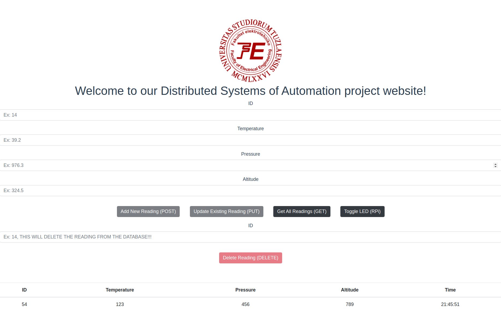
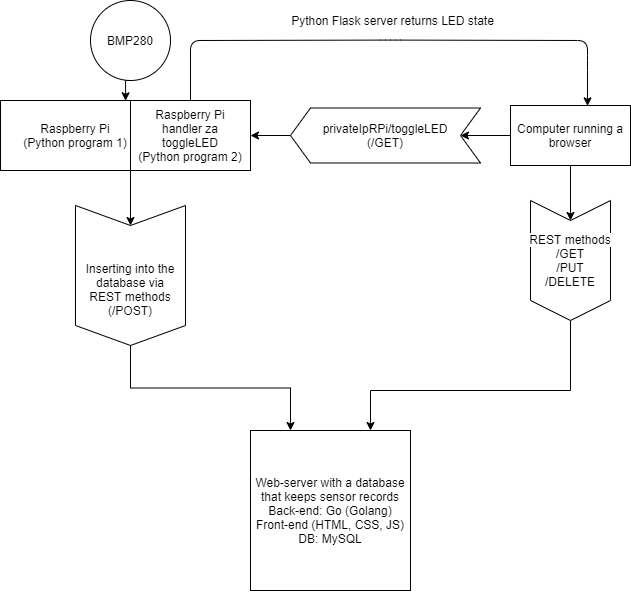

# Raspberry Pi Zero W Weather Station Based on BMP280 Sensor

Website contains a MySQL Database <--> Go backend <--> Vue frontend. 

Data is sent from a Raspberry Pi Zero W that has a BMP280 sensor attached to it. Main server that handles the requests is written in Golang, RPI also runs a server on it own and it used to light up a LED on the RPI to demonstrate duplex functionality and it's written in Python.

## Cloning
```
git clone https://github.com/TRedzepagic/RaspberryPI-weather-station.git
```
## Database setup

To setup database first you need to install mysql-server.
To get the exact same table as me, inside the mysql shell, type these commands :
```
CREATE DATABASE SENSORDATA;
USE SENSORDATA;
CREATE TABLE READINGS
(
    ID int NOT NULL AUTO_INCREMENT,
    Temperature varchar(255) NOT NULL,
    Pressure varchar(255) NOT NULL,
    Altitude varchar(255) NOT NULL,
    Time varchar(255) NOT NULL,
    PRIMARY KEY (ID)
);
```
Now it's time to setup your user. You can do that by running this command in the mysql shell:

```
CREATE USER 'testuser'@'localhost' IDENTIFIED BY 'testpassword';
```
Now we need to grant all privileges to the user so he can add to the tabel delete etc.
```
GRANT ALL PRIVILEGES ON SENSORDATA.READINGS TO 'testuser'@'localhost';
```
## How to run

First you need to run the main.go file by running the command :
```
go run main.go
```
Then you need to run i2cSensorTransmit.py file on the RPI to enable data transmission to the server, run the command :
```
python3 i2cSensorTransmit.py
```
In order to enable led control from the website you need to run ledServer.py file on the RPI as well by running the commands:
```
export FLASK_APP=ledServer.py
sudo -E flask run --host=0.0.0.0 --port=8090
```
# Vue website

## raspberry-pi-weather-station

### Project setup
```
sudo apt install nodejs (if you don't have it)
npm install @vue/cli
npm install
npm install --save axios
```

### Compiles and hot-reloads for development
```
npm run serve
```

### Compiles and minifies for production
```
npm run build
```

### Lints and fixes files
```
npm run lint
```

### Customize configuration
See [Configuration Reference](https://cli.vuejs.org/config/).

## Principle Working Diagram

